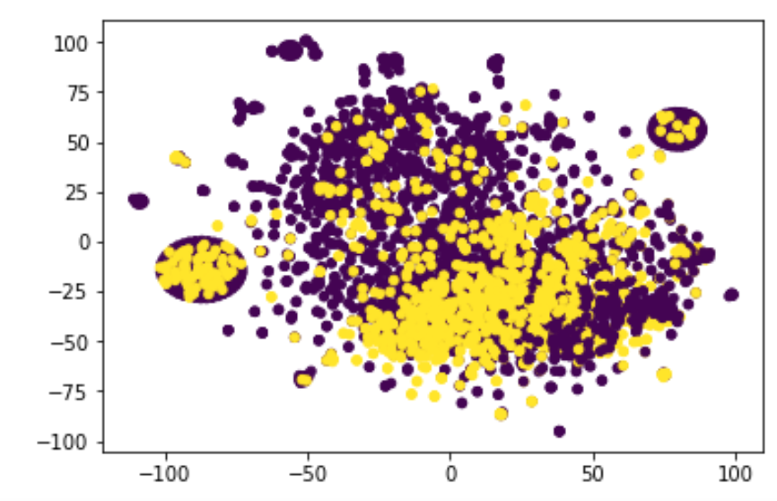

# Proyecto BigData

## Dataset

Se utilizó el dataset de sentimientos de twitter apple, disponible en el enunciado del proyecto./

## Requerimientos

Para realizar los siguientes experimentos, para prepocesamiento se utilizo excel y python 3.6. Para el training se requirio instalar python 2.7 y utilizar pip para instalar la libreria Gensim, para ello seguimos el siguiente tutorial: http://blog.leifmadsen.com/blog/2017/01/03/installing-python-2.7-on-centos-6.x/. Por último, usamos 
GloVe de 6B en su version de 50 dimensiones, el cual es transformado al formato de gensim con el script convert.py disponible en [Código base](https://github.com/farojos/proyecto_bigdata/blob/master/training/convert.py)


Comando para correr spark:

``` spark-submit --master local[2] sparkScript.py localhost 54321 ```

El flag --master local[2] permite ejecutar en local 2 threads, uno que escuche el streaming y el otro que corra el worker (véase documentacion cloudera cloudera docs).

Al igual que en el caso anterior, flume se corre con el mismo comando:

``` flume-ng agent --conf-file sparkStreamingFLUME.conf --name hw3Flume ```

## Preprocesamiento. 

### Parte 1. Excel

Para el preprocesamiento, se elimino las columnas no utiles con excel, y se filtro todas las entradas que no tenian una nota valida de sentimiento.

### Parte 2. Python

El resultado anterior deja un archivo en el cual hay caracteres especiales (',','.','#',...) y hay un serio problema con los saltos de linea. En 
especifico, los saltos de lineas son utilizados para separar los tweets, pero tambien pueden existir en los mismos tweets. Por ultimo,
en adición a las correcciones anteriores, la libreria mllib de pyspark no soporta multiples clases (los sentimientos en este dataset van de 1 a 5), por lo que los pasamos en la siguiente forma, si el sentimiento es 3 4 o 5 entonces 1, en caso contrario 0.

## Training

Al igual que la tarea 3, no se cambio el archivo de flume respecto a la pregunta 3 de esta tarea, el cual esta disponible en [Código base](https://github.com/farojos/proyecto_bigdata/blob/master/training/myConfigFileName%20(3).conf.txt).
Sin embargo, el script de spark tuvo que cambiar en gran medida[Código base](https://github.com/farojos/proyecto_bigdata/blob/master/training/sparkScript%20(2).py)
. Primero filtramos que el streaming no sea vacio (para no procesar data vacia). Tambien agregamos GloVe con 50 dimensiones para codificar las palabras. Si una palabra no se encuentra esta se ignora. Posteriormente promediamos los embeddings de las palabras en el diccionario. Esto despues lo pasamos por un clasificador LinearSVM, disponible en la libreria mllib(from pyspark.mllib.classification import SVMWithSGD). Por último, hacemos las predicciones, imprimimos la matriz de confusion y guardamos los vectores con su prediccion y valor real, los cuales son procesados en un script externo. 

## Resultados

Con el trabajo realizado previamente, se obtiene la siguiente matriz de confusión: 
``` [[319, 900], [124, 2461]] ```

Se concluye que haber tenido que disminuir de 5 categorías de sentimiento a 2, redujo sustancialmente la performance del trabajo. Se observa con la matriz de confusión que hay un sesgo hacia el cluster '1'. Esto es lógico ya que la clasificación '1', contiene 3 de las 5 categorías iniciales.

Se reutilizó el tsne de la tarea 3 para mostrar los resultados. En el gráfico los puntos morados representan las clasificaciones predecidas correctamente y en amarillo los errores.



Se disminuyó de dimensionalidad 50 a 2 para poder representar el resultado en 2D. Se observa un resultado bastante coherente, con 2 clusters a cada costado y luego un gran cluster al centro, donde deben cruzarse los otros 3 clusters. De todas formas, se ven puntos amarillos en prácticamente todo el gráfico, lo que se puede explicar con la pérdida de información uniforme en todos los grupos que se tuvo que la disminución de categorías.
